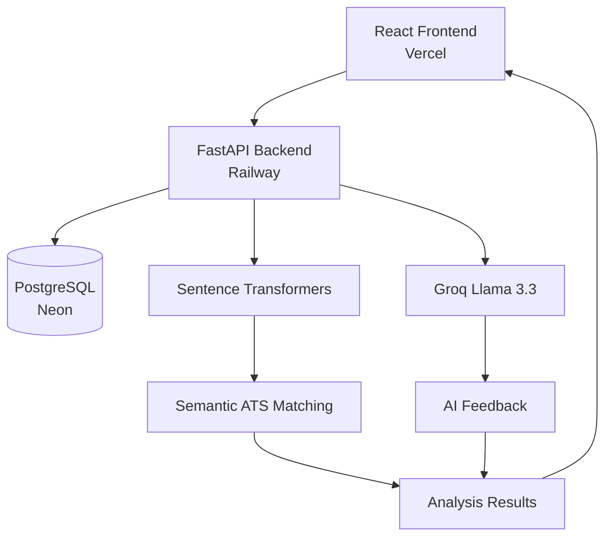
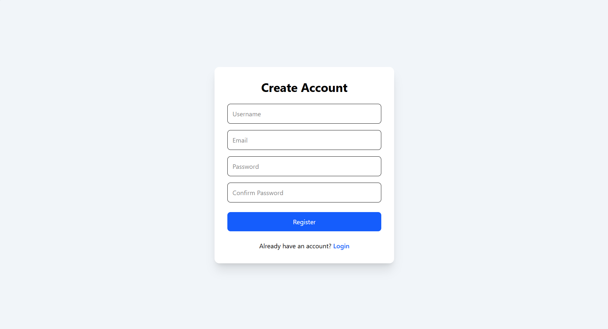
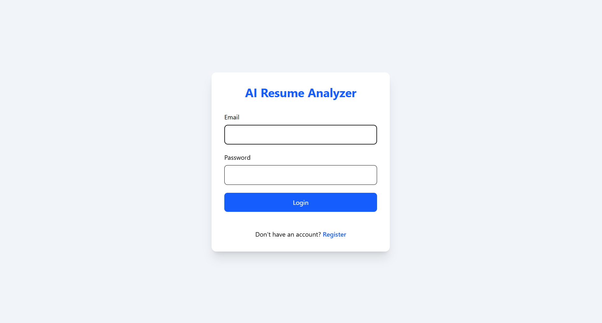
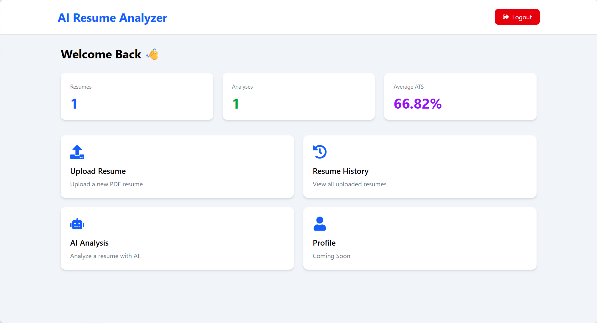
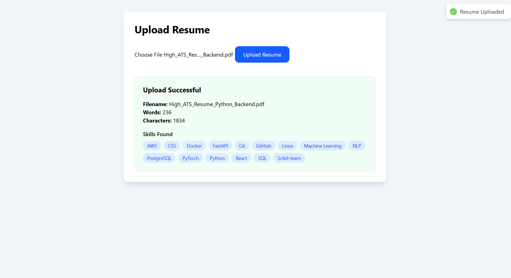
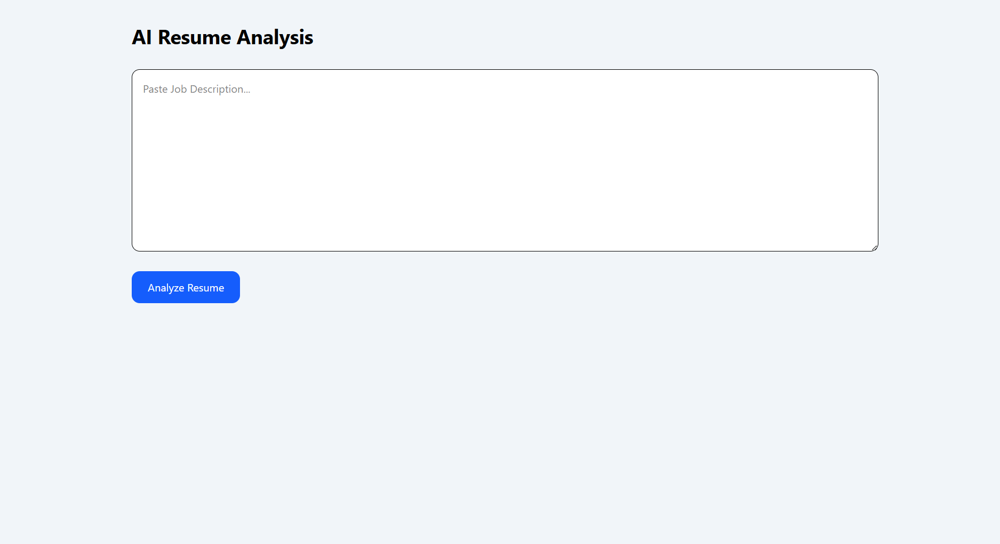
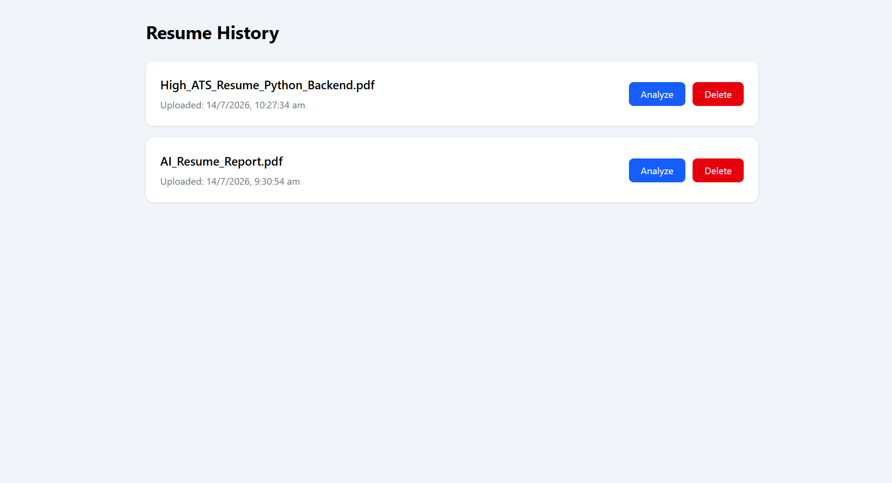

# 🤖 AI Resume Analyzer


An AI-powered Resume Analyzer that evaluates resumes against job descriptions using semantic similarity and Large Language Models (LLMs). The application calculates ATS compatibility, identifies matched and missing skills, generates AI-driven feedback, and suggests resume improvements and interview questions.

Built with **FastAPI**, **React**, **PostgreSQL**, **Sentence Transformers**, and **Groq Llama 3.3**.

## 🌐 Live Demo

**Frontend:**  
https://ai-resume-analyzer-eight-murex.vercel.app/

**Backend API:**  
https://ai-resume-analyzer-production-ec15.up.railway.app/docs

**GitHub Repository:**  
https://github.com/YOUR_USERNAME/AI_Resume_Analyzer

## ✨ Features

- 🔐 JWT Authentication (Register & Login)
- 📄 Upload PDF resumes
- 📝 Extract resume text automatically
- 🎯 AI-powered ATS score calculation
- 🤝 Semantic resume-job matching
- 🧠 LLM-generated resume feedback
- ✅ Skill gap analysis
- 💡 Resume improvement suggestions
- ❓ AI-generated interview questions
- 📥 Download analysis as PDF
- 📚 Resume history management
- 📊 Dashboard analytics
- ☁️ Cloud deployment with Railway & Vercel

## 🛠️ Tech Stack

### Frontend
- React
- Vite
- Tailwind CSS
- Axios
- React Router
- React Hot Toast

### Backend
- FastAPI
- SQLAlchemy
- PostgreSQL (Neon)
- JWT Authentication
- Pydantic

### AI & Machine Learning
- Sentence Transformers
- Scikit-learn
- Groq API
- Llama 3.3 70B

### Deployment
- Railway
- Vercel
- Neon PostgreSQL

### Tools
- Git
- GitHub
- VS Code

## 🏗️ System Architecture



## 📸 Screenshots

### Register



### Login



### Dashboard



### Upload Resume



### AI Analysis

(screenshots/analyze_resume.png)(screenshots/analyze_resume1.png)

### Resume History



### Generated PDF Report

(screenshots/pdf-report2.png)(screenshots/pdf-report3.png)

## 📂 Project Structure

```text
AI_Resume_Analyzer/
│
├── app/
│   ├── api/
│   ├── core/
│   ├── crud/
│   ├── database/
│   ├── models/
│   ├── parsers/
│   ├── prompts/
│   ├── schemas/
│   ├── services/
│   └── utils/
│
├── frontend/
│   ├── src/
│   │   ├── api/
│   │   ├── components/
│   │   ├── context/
│   │   ├── pages/
│   │   └── utils/
│
├── screenshots/
├── requirements.txt
└── README.md
```

## 🚀 Future Improvements

- User profile management
- Resume version comparison
- Multi-language resume support
- Resume keyword optimization
- AI-powered cover letter generation
- Recruiter dashboard
- Email notifications
- Docker containerization

## 👨‍💻 Author

**Sompalli Naveen Kumar**

- GitHub: https://github.com/sompallinaveen
- LinkedIn: *(www.linkedin.com/in/naveen-kumar-ba6867290)*